# AWS Scalable Web App

An AWS based web application featuring high availability and scalability using 
an Application Load Balancer, Auto Scaling Group, and Apache web server, 
monitored with Amazon CloudWatch.

## Architecture Diagram
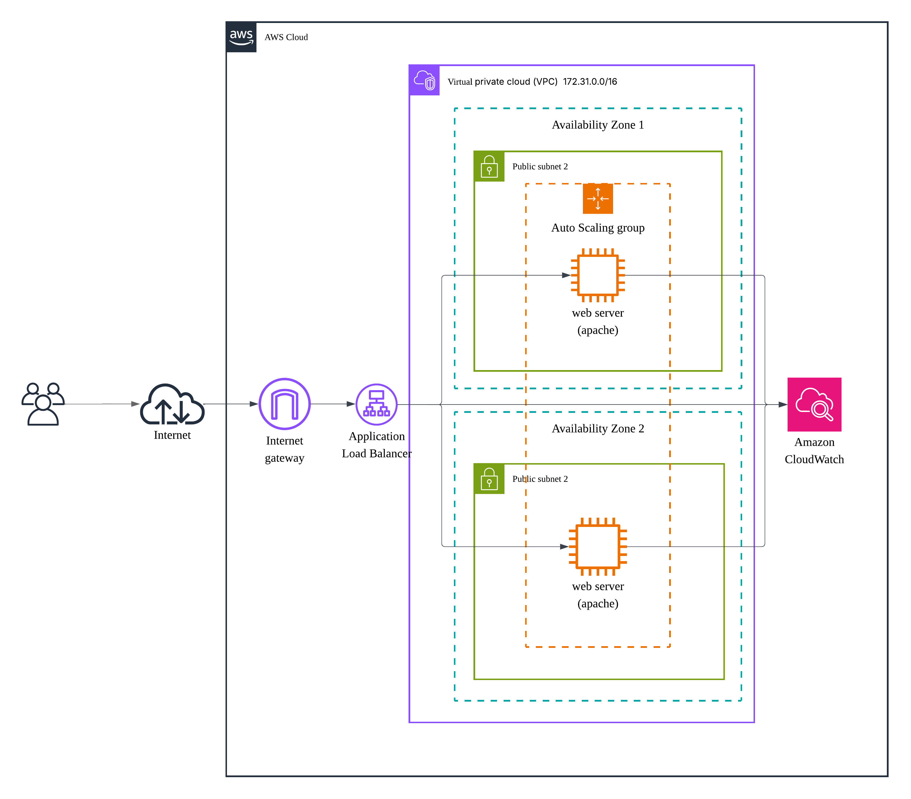
The architecture ditributes HTTP traffic using Application Load Balancer across instances while Auto scaling groups scale capacity based on demand holding to the scalability core concept.

## AWS Services Used

| Service | Purpose |
|---------|---------|
| VPC | Isolated network environment |
| EC2 | Web server hosting Apache |
| Application Load Balancer | Distributes traffic across instances in diffrent availability zones|
| Auto Scaling Group | Automatically scales instances based on demand |
| Security Group| Instance level firewall that controls the traffic allowed to reach the resources|
| CloudWatch | Monitors CPU and performance metrics |
| Internet Gateway | Allows VPC access to public internet |

## Features
- Auto scaling based on demand (minimum of 1 instance, maximum is 2, desired 1)
- High availability across multiple Availability Zones
- Load balancing with ALB
- CloudWatch monitoring and alerting

## Infrastructure Overview

### Networking
- VPC with public subnets across 3 Availability Zones
- Internet Gateway attached for public access
- Route tables configured for internet traffic

### Security Groups
- ALB security group: allows inbound HTTP port 80 from `0.0.0.0/0`
- EC2 security group: allows inbound HTTP port 80 from ALB security group only
- EC2 security group: allows inbound SSH port 22 from private IP adress.
-  
### Launch Template
- Amazon Linux 2 AMI
- t3.micro instance type
- User data script to auto install and start Apache on launch

### Load Balancer
- Internet-facing Application Load Balancer
- HTTP listener on port 80
- Forwards traffic to target group

### Auto Scaling Group
- Desired: 1, Min: 1, Max: 2
- Automatically registers instances into target group
- Automatically Launches instances from launch template

## Deployment Steps

1. Create VPC with CIDR `10.0.0.0/16`
2. Create public subnets in multiple AZs with auto-assign public IP enabled
3. Create and attach Internet Gateway
4. Configure route tables with `0.0.0.0/0 → IGW`
5. Create ALB and EC2 security groups
6. Add inbound rules for security groups
7. Create launch template with Apache user data script
8. Create Application Load Balancer (internet-facing)
9. Create target group with HTTP port 80 health check
10. Create Auto Scaling Group attached to target group
11. Verify instance is healthy in target group
12. Access website via ALB DNS name

## Screenshots

### VPC
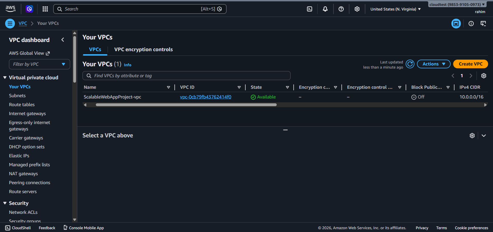

### Subnets
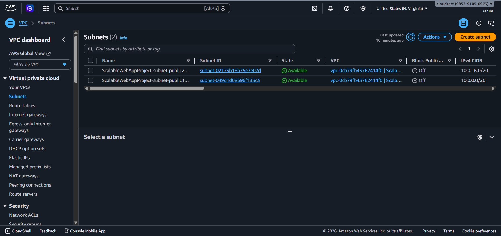

### Internet Gateway
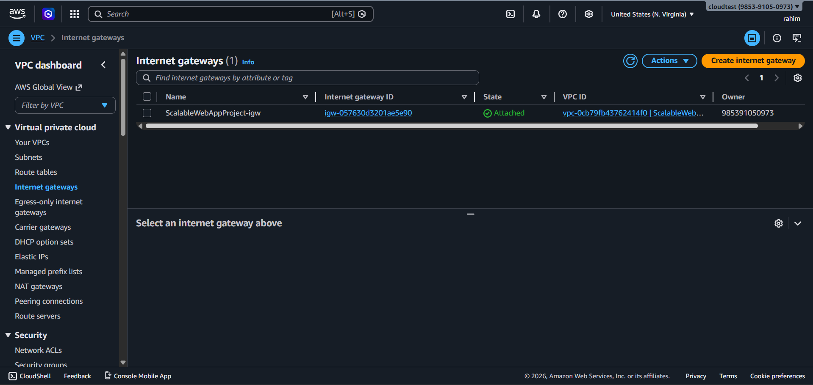

### Application Load Balancer
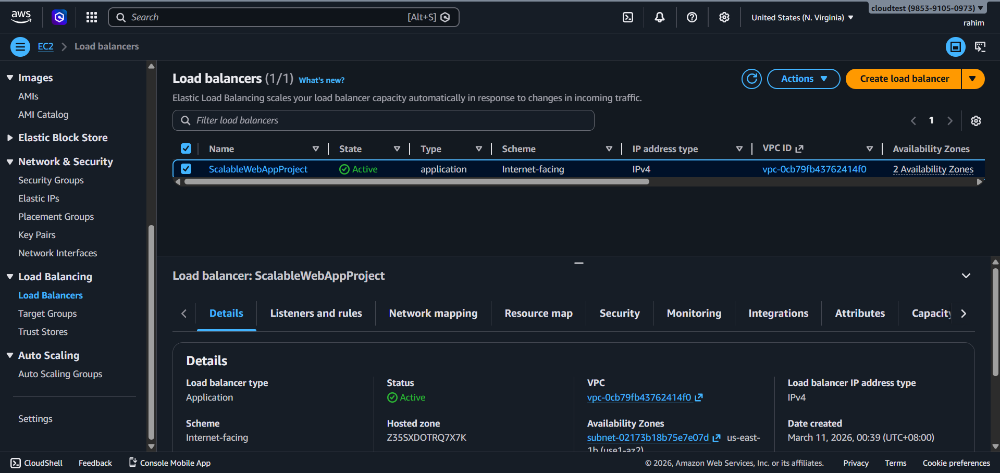

### Healthy Target Group
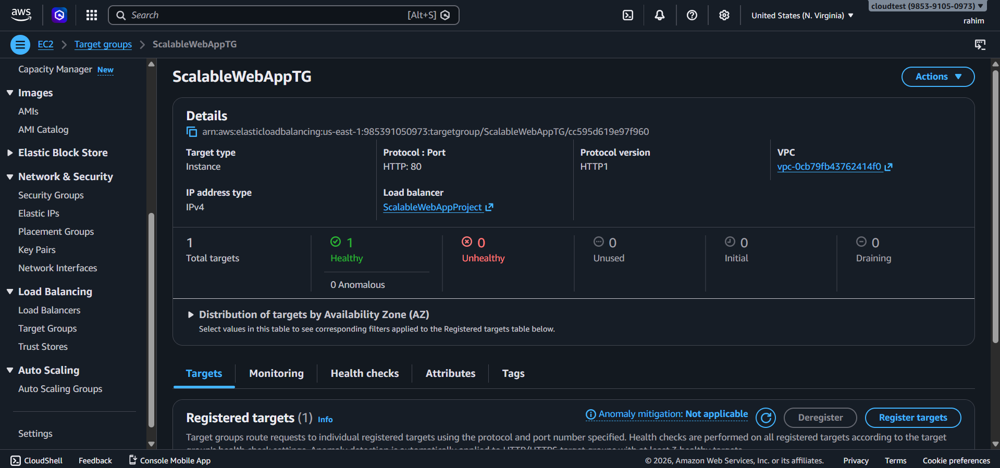

### Auto Scaling Group
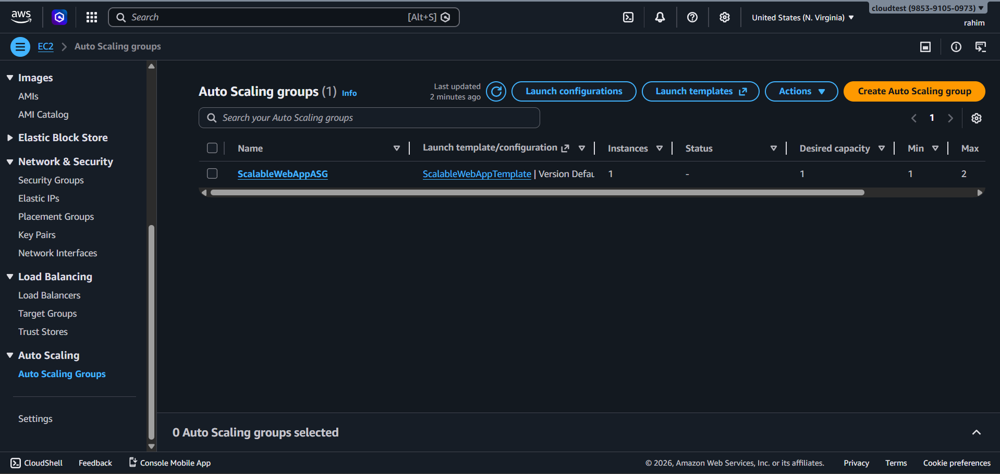

### CloudWatch Metrics
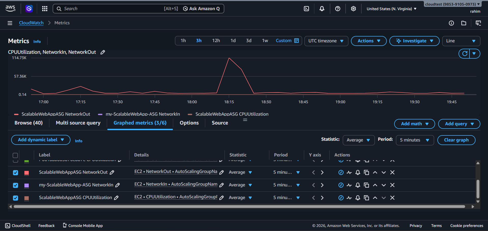

### Website
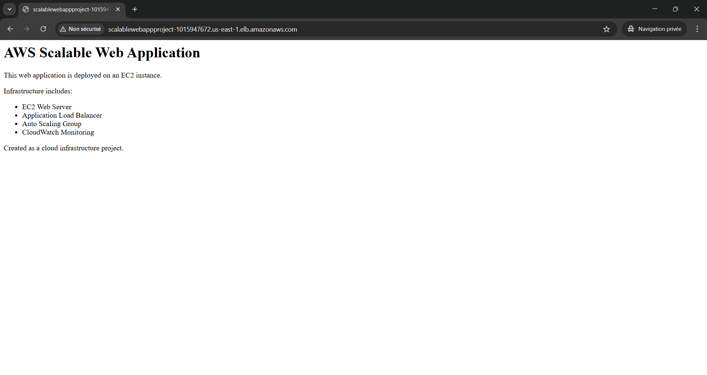

## Challenges & Lessons Learned
- ALB scheme (internal vs internet-facing) cannot be changed after creation
- ASG only manages instances it creates itself — manual instances must be 
  converted to an AMI and baked into the launch template
- Launch template must include a user data script to auto install Apache, 
  otherwise ASG instances launch without a web server, in that case Apache needs to be installed manually
- Security groups must be carefully configured — EC2 should only accept 
  traffic from the ALB security group, not from `0.0.0.0/0`

## Future Improvements
- Add HTTPS with SSL certificate via AWS Certificate Manager
- Use a custom domain with Route 53
- Move EC2 instances to private subnets with a NAT Gateway
- Add RDS database for dynamic content
- Implement CloudWatch alarms with SNS notifications
- 
## Tech Stack

AWS (EC2, , VPC, ALB, Auto Scaling, CloudWatch)
Linux
Apache

## Testing Section

To ensure the scalability functionality, we apply stress using:
 stress --cpu 2 --timeout 300
As a response The Auto Scaling Group generates a new instance.
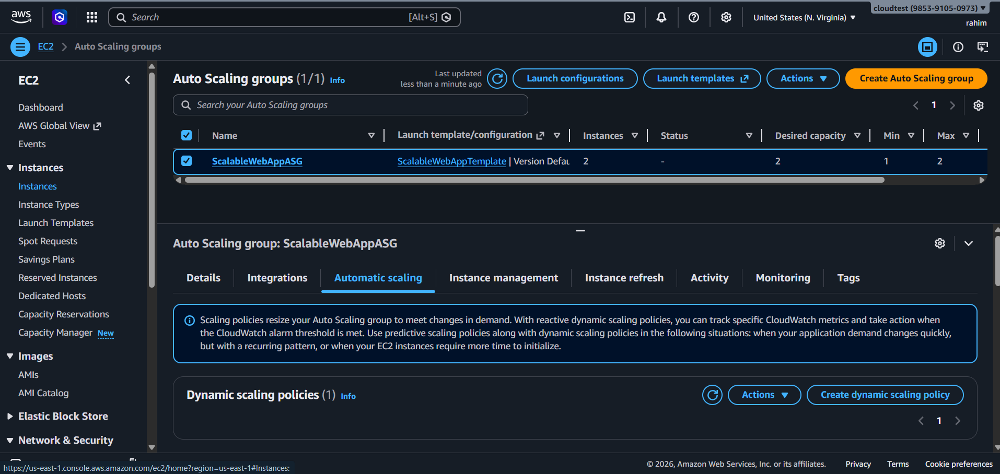
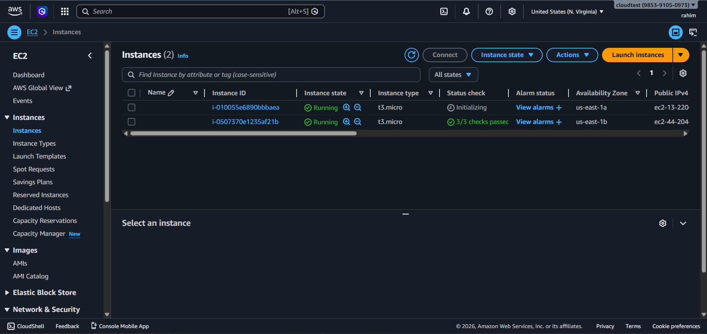

